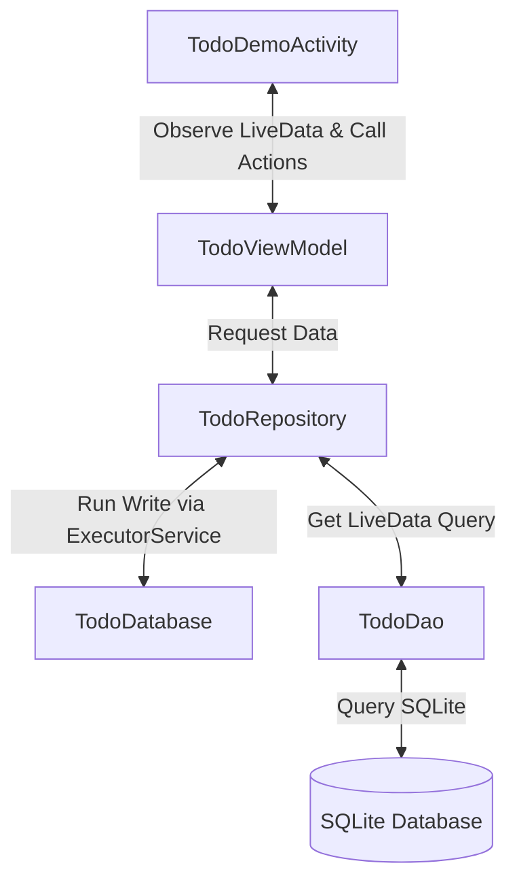

# Tích hợp Room Database, LiveData và ExecutorService trong Android

## 1. Mục tiêu demo

Phần này demo cách tích hợp cơ sở dữ liệu Room Database (SQLite wrapper) để lưu trữ danh sách ghi chú (Todo list) bất đồng bộ bằng `ExecutorService` và `LiveData`. 

Các file nguồn nằm trong package:
```text
com.rsui.rs_datapersistence.pack3
```

Các file Activity, Adapter và Model chính:
- `Todo.java`: Entity đại diện cho bảng dữ liệu.
- `TodoDao.java`: Định nghĩa các phương thức truy vấn và tương tác dữ liệu (CRUD).
- `TodoDatabase.java`: Cấu hình database và cung cấp `ExecutorService` dùng chung.
- `TodoRepository.java`: Quản lý dữ liệu sạch, điều phối giữa DB và ExecutorService.
- `TodoViewModel.java`: Cung cấp LiveData cho Activity, tồn tại độc lập với vòng đời UI.
- `TodoAdapter.java`: Cầu nối dữ liệu danh sách lên `RecyclerView`, sử dụng `DiffUtil`.
- `TodoDemoActivity.java`: Màn hình giao diện người dùng chính của Todo List.

Giao diện layout nằm ở:
- `app/src/main/res/layout/activity_todo_demo.xml`
- `app/src/main/res/layout/item_todo.xml`
- `app/src/main/res/layout/dialog_todo.xml`

---

## 2. Room Database là gì?

**Room** là một thư viện Object Mapping (ORM) do Google phát triển, đóng vai trò là một lớp trừu tượng (abstraction layer) phía trên SQLite thuần. 

So với SQLite truyền thống (`SQLiteOpenHelper`), Room mang lại các lợi ích lớn:
- **Giảm boilerplate code**: Không cần viết các dòng code mở/đóng kết nối dài dòng, tự động chuyển đổi đối tượng Java thành bản ghi cơ sở dữ liệu.
- **Kiểm tra câu lệnh truy vấn lúc biên dịch (Compile-time verification)**: Nếu bạn viết sai tên bảng hoặc thuộc tính trong câu lệnh `@Query`, trình biên dịch sẽ báo lỗi ngay lập tức thay vì bị crash khi chạy ứng dụng.
- **Tích hợp hoàn hảo với kiến trúc Jetpack**: Room hỗ trợ trả về `LiveData`, `Flow` hoặc các thành phần bất đồng bộ khác giúp giao diện tự động cập nhật mỗi khi cơ sở dữ liệu thay đổi.

---

## 3. Tại sao cần xử lý bất đồng bộ?

Trong Android, các thao tác đọc/ghi cơ sở dữ liệu (I/O operations) tiêu tốn tài nguyên và thời gian. 

### Quy tắc quan trọng:
> [!WARNING]
> **Không bao giờ thực hiện các thao tác ghi dữ liệu Room Database trên Main Thread (UI Thread).** 
> Nếu cố tình thực thi trên Main Thread, ứng dụng sẽ bị treo tạm thời (gây giật lag UI) hoặc trực tiếp crash với lỗi `java.lang.IllegalStateException: Cannot access database on the main thread since it may potentially lock the UI for a long period of time.`

Trong demo này, chúng ta áp dụng hai cơ chế bất đồng bộ tiêu chuẩn của Android Jetpack:
1. **ExecutorService (Luồng nền)**: Dùng để thực thi các tác vụ ghi dữ liệu như `insert`, `update`, và `delete` độc lập trên một hàng đợi luồng phụ (Thread Pool), tránh khóa luồng giao diện chính.
2. **LiveData (Quan sát dữ liệu)**: Dùng cho các tác vụ truy vấn dữ liệu (`select`). Khi câu lệnh SELECT trả về kiểu `LiveData<List<Todo>>`, Room sẽ tự động chạy truy vấn trên luồng nền của nó và truyền kết quả về Main Thread để cập nhật UI.

---

## 4. Kiến trúc MVVM trong Demo

Ứng dụng demo áp dụng mô hình kiến trúc chuẩn được đề xuất bởi Google:



- **Database / DAO**: Tầng lưu trữ dữ liệu thực tế.
- **Repository**: Tầng quản lý nguồn dữ liệu, đưa ra API sạch cho ViewModel.
- **ViewModel**: Giữ dữ liệu giao diện và tiếp nhận tương tác từ UI.
- **Activity (UI)**: Quan sát (observe) dữ liệu LiveData từ ViewModel và hiển thị lên RecyclerView.

---

## 5. Các bước triển khai chi tiết & Code Snippet

### Bước 5.1: Khai báo thư viện (Gradle)

Trong version catalog `gradle/libs.versions.toml`:
```toml
[versions]
room = "2.6.1"
lifecycle = "2.8.7"

[libraries]
room-runtime = { group = "androidx.room", name = "room-runtime", version.ref = "room" }
room-compiler = { group = "androidx.room", name = "room-compiler", version.ref = "room" }
lifecycle-viewmodel = { group = "androidx.lifecycle", name = "lifecycle-viewmodel", version.ref = "lifecycle" }
lifecycle-livedata = { group = "androidx.lifecycle", name = "lifecycle-livedata", version.ref = "lifecycle" }
```

Trong `app/build.gradle.kts`:
```kotlin
dependencies {
    // Room Database
    implementation(libs.room.runtime)
    annotationProcessor(libs.room.compiler)
    
    // Lifecycle (ViewModel & LiveData)
    implementation(libs.lifecycle.viewmodel)
    implementation(libs.lifecycle.livedata)
}
```

### Bước 5.2: Tạo thực thể dữ liệu (Entity)

Lớp `Todo` đại diện cho cấu trúc bảng `todos` trong SQLite.

```java
package com.rsui.rs_datapersistence.pack3;

import androidx.room.Entity;
import androidx.room.PrimaryKey;

@Entity(tableName = "todos")
public class Todo {
    @PrimaryKey(autoGenerate = true)
    private int id; // Khóa chính tự động tăng

    private String title;
    private String description;
    private boolean isCompleted;
    private long createdAt; // Lưu thời gian tạo bằng timestamp

    public Todo(String title, String description, boolean isCompleted, long createdAt) {
        this.title = title;
        this.description = description;
        this.isCompleted = isCompleted;
        this.createdAt = createdAt;
    }

    // Các hàm Getters và Setters tương ứng
    // ...
}
```

### Bước 5.3: Tạo lớp DAO (Data Access Object)

DAO chứa các phương thức tương tác với cơ sở dữ liệu được chú thích bằng các annotation của Room.

```java
package com.rsui.rs_datapersistence.pack3;

import androidx.lifecycle.LiveData;
import androidx.room.Dao;
import androidx.room.Delete;
import androidx.room.Insert;
import androidx.room.Query;
import androidx.room.Update;
import java.util.List;

@Dao
public interface TodoDao {
    @Insert
    void insert(Todo todo);

    @Update
    void update(Todo todo);

    @Delete
    void delete(Todo todo);

    // Truy vấn này trả về LiveData. Room sẽ thực thi nó bất đồng bộ
    // và cập nhật danh sách mỗi khi dữ liệu thay đổi.
    @Query("SELECT * FROM todos ORDER BY createdAt DESC")
    LiveData<List<Todo>> getAllTodos();
}
```

### Bước 5.4: Tạo Database lớp cấu hình (Database)

Cấu hình cơ sở dữ liệu kế thừa `RoomDatabase` và khởi tạo Thread Pool thông qua `ExecutorService`.

```java
package com.rsui.rs_datapersistence.pack3;

import android.content.Context;
import androidx.room.Database;
import androidx.room.Room;
import androidx.room.RoomDatabase;
import java.util.concurrent.ExecutorService;
import java.util.concurrent.Executors;

@Database(entities = {Todo.class}, version = 1, exportSchema = false)
public abstract class TodoDatabase extends RoomDatabase {
    public abstract TodoDao todoDao();

    private static volatile TodoDatabase INSTANCE;
    private static final int NUMBER_OF_THREADS = 4;
    
    // Thread Pool gồm 4 luồng nền cố định để xử lý tác vụ ghi DB
    public static final ExecutorService databaseWriteExecutor =
            Executors.newFixedThreadPool(NUMBER_OF_THREADS);

    public static TodoDatabase getDatabase(final Context context) {
        if (INSTANCE == null) {
            synchronized (TodoDatabase.class) {
                if (INSTANCE == null) {
                    INSTANCE = Room.databaseBuilder(context.getApplicationContext(),
                                    TodoDatabase.class, "todo_database")
                            .build();
                }
            }
        }
        return INSTANCE;
    }
}
```

### Bước 5.5: Tạo lớp Repository

Repository đóng vai trò trung gian để quản lý dữ liệu sạch sẽ, phối hợp giữa DAO và ExecutorService để thực hiện các thao tác CRUD bất đồng bộ.

```java
package com.rsui.rs_datapersistence.pack3;

import android.app.Application;
import androidx.lifecycle.LiveData;
import java.util.List;

public class TodoRepository {
    private final TodoDao todoDao;
    private final LiveData<List<Todo>> allTodos;

    public TodoRepository(Application application) {
        TodoDatabase db = TodoDatabase.getDatabase(application);
        todoDao = db.todoDao();
        allTodos = todoDao.getAllTodos();
    }

    public LiveData<List<Todo>> getAllTodos() {
        return allTodos;
    }

    // Các thao tác ghi cần chạy bất đồng bộ qua ExecutorService
    public void insert(Todo todo) {
        TodoDatabase.databaseWriteExecutor.execute(() -> todoDao.insert(todo));
    }

    public void update(Todo todo) {
        TodoDatabase.databaseWriteExecutor.execute(() -> todoDao.update(todo));
    }

    public void delete(Todo todo) {
        TodoDatabase.databaseWriteExecutor.execute(() -> todoDao.delete(todo));
    }
}
```

### Bước 5.6: Tạo lớp ViewModel

ViewModel giúp dữ liệu tồn tại độc lập với vòng đời của Activity (ví dụ khi xoay màn hình, dữ liệu trong ViewModel không bị mất đi).

```java
package com.rsui.rs_datapersistence.pack3;

import android.app.Application;
import androidx.annotation.NonNull;
import androidx.lifecycle.AndroidViewModel;
import androidx.lifecycle.LiveData;
import java.util.List;

public class TodoViewModel extends AndroidViewModel {
    private final TodoRepository repository;
    private final LiveData<List<Todo>> allTodos;

    public TodoViewModel(@NonNull Application application) {
        super(application);
        repository = new TodoRepository(application);
        allTodos = repository.getAllTodos();
    }

    public LiveData<List<Todo>> getAllTodos() {
        return allTodos;
    }

    public void insert(Todo todo) {
        repository.insert(todo);
    }

    public void update(Todo todo) {
        repository.update(todo);
    }

    public void delete(Todo todo) {
        repository.delete(todo);
    }
}
```

### Bước 5.7: Hiển thị giao diện và quan sát LiveData (UI)

Trong `TodoDemoActivity.java`, ta khởi tạo ViewModel và thiết lập quan sát LiveData:

```java
// Setup ViewModel
todoViewModel = new ViewModelProvider(this).get(TodoViewModel.class);

// Quan sát LiveData: Khi danh sách Todo thay đổi, UI tự động cập nhật
todoViewModel.getAllTodos().observe(this, todos -> {
    if (todos == null || todos.isEmpty()) {
        layoutEmptyState.setVisibility(View.VISIBLE);
        recyclerView.setVisibility(View.GONE);
    } else {
        layoutEmptyState.setVisibility(View.GONE);
        recyclerView.setVisibility(View.VISIBLE);
    }
    // Gán danh sách mới cho adapter
    adapter.setTodos(todos);
});
```

---

## 6. Trải nghiệm và thử nghiệm demo

Sau khi cài đặt ứng dụng:
1. Mở ứng dụng từ màn hình chính `MainActivity`.
2. Bấm vào **3. Room Database & LiveData** để mở màn hình quản lý Todo.
3. **Thêm Todo**: Nhấn nút `+` (FAB) góc dưới bên phải. Nhập tiêu đề và mô tả trong hộp thoại rồi bấm **Lưu**. Bản ghi mới được tạo trên luồng nền của `ExecutorService`, lưu vào cơ sở dữ liệu SQLite, và nhờ `LiveData`, danh sách trên màn hình tự động hiển thị ngay lập tức.
4. **Cập nhật trạng thái**: Bấm vào CheckBox ở mỗi Todo. Trạng thái `isCompleted` thay đổi, tiêu đề sẽ tự động gạch ngang chữ và thay đổi độ mờ của cả thẻ để biểu thị công việc đã hoàn tất.
5. **Chỉnh sửa / Xóa**: Nhấn nút bút chì để sửa nội dung Todo, hoặc nhấn biểu tượng thùng rác để xóa (sẽ có hộp thoại xác nhận trước khi thực hiện).
6. **Kiểm tra lưu trữ vĩnh viễn (Persistence)**: Hãy tắt ứng dụng đi hoàn toàn hoặc khởi động lại máy ảo. Mở lại ứng dụng, toàn bộ dữ liệu Todo list của bạn vẫn được giữ nguyên vẹn.
